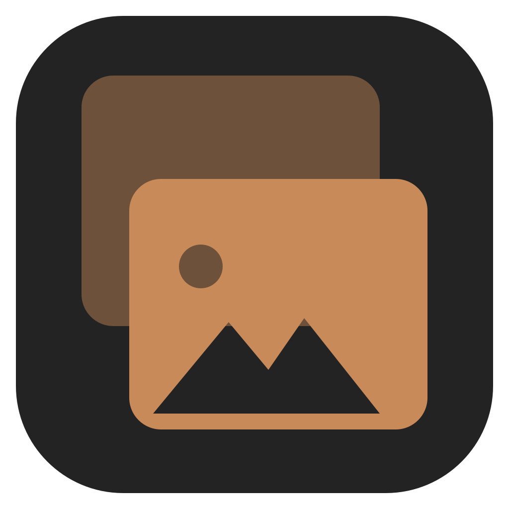

<p align="center">
   
</p>

<h1 align="center">Deduup</h1>

<p align="center">
   <strong>Clear your copies with ease.</strong><br />
   Find, review, and safely remove duplicate files.
</p>

<p align="center">
   <a href="https://github.com/NoomStuff/Deduup/releases/latest">Download</a> ·
   <a href="CONTRIBUTING.md">Contributing</a>
</p>

Deduup scans a folder for images that look the same (exact duplicates, resizes, re-encodes, light edits), groups them into sets, and lets you judge each set once.

## Downloads

Get the latest build from the [releases page](https://github.com/NoomStuff/Deduup/releases/latest): Windows installer or portable exe, macOS dmg (unsigned: right-click → Open the first time), Linux AppImage. Installed Windows builds update automatically; the portable build and AppImage offer a verified download.

## How removal stays safe

Removal is three explicit steps:

1. **Discard** images while reviewing. Nothing happens to your files yet.
2. **Move** them in the final review. Discarded images land in a "duplicates" folder.
3. **Recycle** that folder when you're happy, or undo the move any time before that.

Moving and recycling always ask for confirmation. The app never removes anything on its own.

## Development

```sh
bun install
bun run dev       # vite + electron
bun run verify    # format, lint, typecheck, unit tests, UI smoke test
bun run dist      # package for the current OS
```

See [CONTRIBUTING.md](CONTRIBUTING.md) for the full development guide and the release process. `AGENTS.md` describes working conventions for agents.
